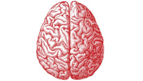

 
I am currently working with Prof. Peter Uhlhaas from the University of Glasgow, member of the International [Working Group on Basic Symptoms](https://basicsymptoms.org/about-us/). Currently, we are investigating aberrant perceptual experiences, from the very basic visual and auditory type, and their association with schizotypal traits found in the general populaiton as well as in clinical samples.

 
Our view is that there are subtle changes in perception that occur in schizophrenia which may have much greater importance for understanding of the disorder than currently believed. Therefore, we are now collecting online data from reports of pathology characteristic  audio visual aberrations from healthy participants. We are trying see if such experiences correlate measured shcizotypal personality traits, with the aim to later on compare the data with reports from clinically diagnosed patients.

 
If interested in contributing and spread the word about our project, the study can be accessed online. It contains a list of very specific questions about personal experiences and some very basic demographic data.

 
The project is supported by the University of Glasgow. It is done in association with Steven Silverstein, Rutgers University.