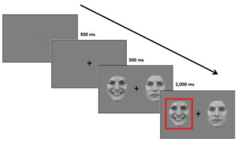

 

###**Changes in attentional bias in response to a mild stress induction procedure and its effect on self-reported mood ratings in participants with high and low symptoms of dysphoria (2017)**

 
The study investigated the relationship between reaction times recorded during a dot-probe task where participants had to shift attention form emotional facial expressionin in order to respond to a target, and depression symptoms. We derived from the idea was that attention to positive and negative stimuli may be crucial to emotion regulation and that shifts in attention may be specifically impaired in participants who suffer from the disorder.Capture

 
In order to test emotion regulation via attention allocation, we asked participants to complete a modified dot-probe task with emotional facial expressions before and after beign induced to experience mild stress. The task paradigm was similar to the one applied in  Sanchez, Vazquez, Gomez, & Joormann (2014).

 
You can read the study report [here](https://drive.google.com/file/d/0B0atL6rrN0sCUnRmSl9fOEUySVE/view?usp=sharing).

 

##Additional work

 
[Bilingualism and cognitive reserve in patients suffering from Alzheimer’sdisease: literature review of critical issues](https://drive.google.com/file/d/0B0atL6rrN0sCUlFVZGRqY1RzZ1U/view).

