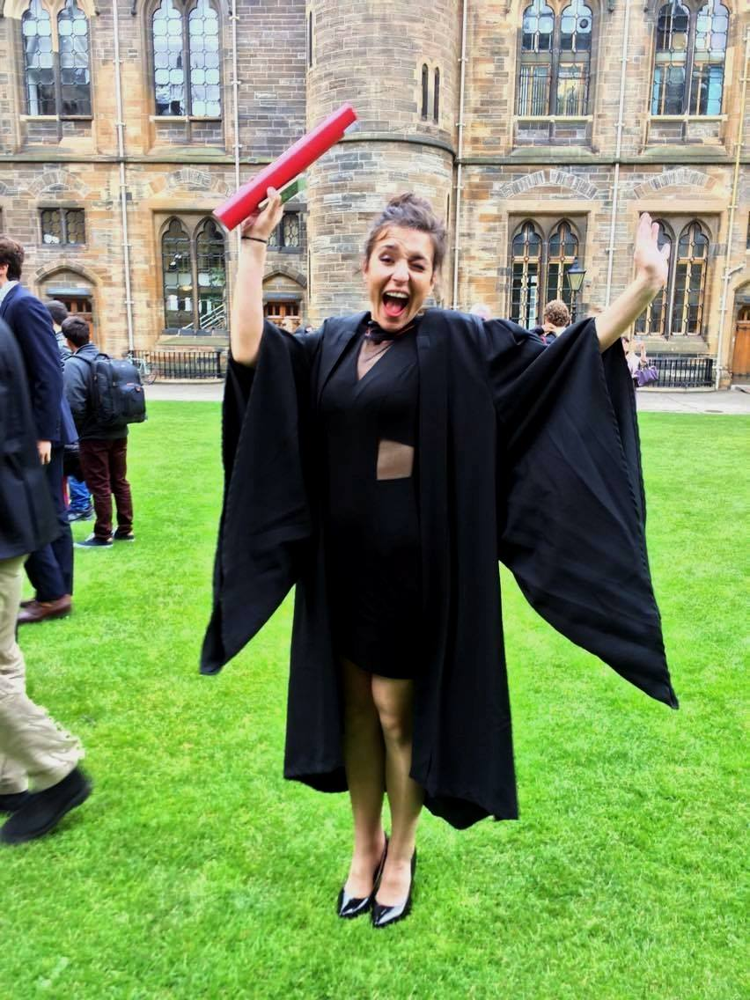

 

 
 
I am a researcher in Psychology at the University of Glasgow. Currently undertaking my Masters degree in Research Methods. My work is concerned with the investigation of basic symptoms in shcizophrenia spectrum disorders. Taking part in the Basic Symptoms research team, under the direct supervision of Prof. Peter Uhlhaas at Glasgow University.

 

In the short term, my focus falls on looking at basic perceptual aberrations in the visual and auditory domains. I am looking to establish a connection between abnormalities in basic perceptual experiences and schiztypal traits in the general population as well as in patients with existing diagnosis of schizophrenia spectrum disorder.

 
In the long term, I am looking forward to getting more involved in the investigation of schizophrenia disorders from a more neuroscientific perspective. I would like to look at the prodromal percursos of the developing disorder with the potential to  develop preventative strategies to decrease conversion rates and severity of already existing symptoms.
